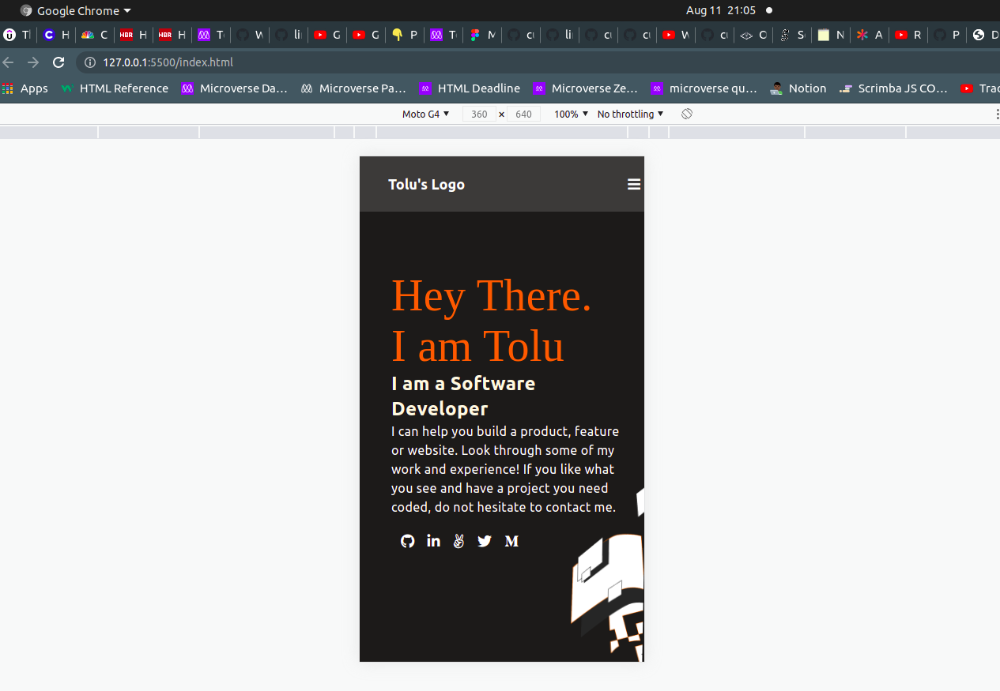

# Portfolio Website

This is my personal portfolio. 

This is the first milestone for my personal portfolio project.
It contains my project, resume and every other information about me.

This milestone consists of two (2) sections:
1. The toolbar (or header)
2. The headline section (right after the header)

## Built With

- HTML
- CSS

## Live Demo

[Live Demo Link]()

## To get a local copy run the following steps:
- Copy this link [this link](https://github.com/Whoistolu/Hello-world-repository)
- Open your terminal or command line
- Run "git clone Paste [this link](https://github.com/Whoistolu/Hello-world-repository)"
- Open the folder with your code editor
- Create a branch to work on
- Now You can edit the code and do a pull request

## Authors

👤 **Author1**

- Name: Ajise Toluwase
- GitHub: [@githubhandle](https://github.com/Whoistolu)
- Twitter: [@twitterhandle](https://twitter.com/Littletolu)
- LinkedIn: [LinkedIn](https://www.linkedin.com/in/toluwase-ajise-9b40411b2/)

## 🤝 Contributing

Contributions, issues, and feature requests are welcome!

## Show your support

Give a ⭐️ if you like this project!

## Acknowledgments

- Hat tip to anyone whose code was used
- Inspiration
- etc

## 📝 License

This project is [MIT](./MIT.md) licensed.
